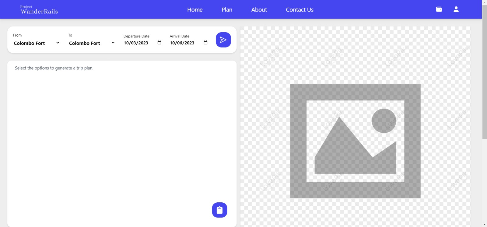
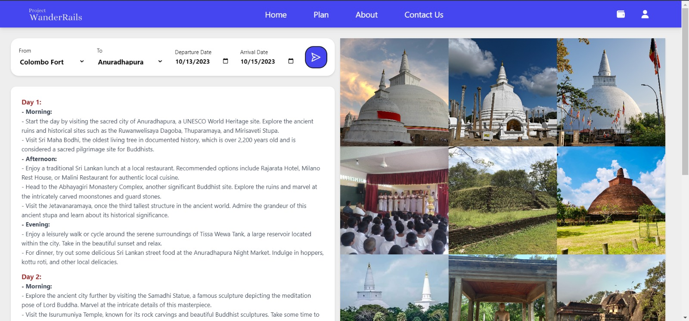

# Project WanderRails 🌍🚆

## Introduction 🌟

Project WanderRails trip planning section is a powerful and user-friendly tool designed to simplify the process of planning your next adventure. This web application leverages OpenAI API to provide you with an effortless and seamless trip planning experience.

## Features 🚀

### 1. Easy Departure and Arrival Selection 🏞️

With the Trip Planner Web App, you can quickly select your departure and arrival train stations. This intuitive interface ensures that you can easily specify your starting and ending points without any hassle.

### 2. Departure and Arrival Dates 📅

Plan your trip with precision by specifying your desired departure and arrival dates. This feature allows you to create a detailed itinerary tailored to your schedule and preferences.

### 3. Destination Insights 📸

Get a sneak peek of your destination with a collection of captivating location photos. These photos are provided by Google Places API, giving you a glimpse of the beauty and attractions that await you at your chosen location.

### 4. Plan Export 📋

If you're satisfied with your trip plan, the app allows you to effortlessly copy it to a text editor of your choice. This way, you can easily share your itinerary with friends and family or save it for future reference.

## Technology Stack 💻

The Trip Planner Web App was built using the following technologies:

- **ReactJS:** A powerful JavaScript library for building user interfaces, ensuring a smooth and responsive user experience.

- **NodeJS:** A versatile server-side runtime environment that enables the backend functionality of the application.

- **ExpressJS:** A minimalist and flexible Node.js web application framework, used for building robust APIs.

- **Axios:** A popular JavaScript library for making HTTP requests, essential for fetching data from external APIs.

- **Tailwind CSS:** A utility-first CSS framework that facilitates the creation of modern and aesthetically pleasing designs.

- **Yarn:** A package manager for managing project dependencies efficiently.

- **Git:** A distributed version control system used for tracking changes and collaborating with other developers.

- **JSON:** For the database of train stations, ensuring that the application has access to accurate and up-to-date information.

## How It Works 🛤️

1. **Selection:** Start by choosing your departure and arrival train stations, along with your preferred departure and arrival dates.

2. **Destination Insights:** Explore a collection of stunning location photos fetched from Google Places API. These images will provide you with a visual preview of your destination.

3. **Trip Planning:** Review your selected options and adjust your trip plan as needed. Once you're satisfied, proceed to the next step.

4. **Export:** If you love your trip plan, you can easily copy it to your preferred text editor for future reference or sharing.

## Getting Started 🚀

To start using the Trip Planner Web App, follow these simple steps:

1. Clone the repository from our GitHub page.

2. Install the required dependencies using Yarn.

3. Run the application by executing these commands: 
	`yarn` 
	`yarn dev` 
	
	new terminal 
	`cd src/server` 
	`yarn` 
	`yarn start` 

4. Access the web app in your browser and begin planning your next adventure.
5. You need to add your own OpenAI and Google Places API Keys.

## Conclusion 🌄

Project WanderRails simplifies the process of planning your next trip. With its user-friendly interface and integration of OpenAI and Google Places APIs, it offers a comprehensive and delightful trip planning experience. Whether you're a seasoned traveler or a first-time adventurer, this web app is your ideal companion for crafting memorable journeys. 🌟✈️

## Screenshots 📸

